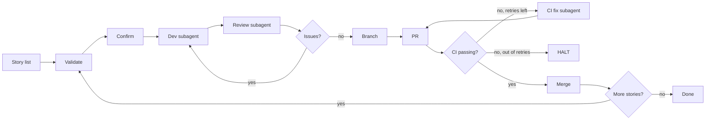

<h1 align="center">
  <picture>
    <source media="(prefers-color-scheme: dark)" srcset="https://raw.githubusercontent.com/mmornati/bmad-dev-loop/main/docs/public/logo.svg">
    
  </picture>
</h1>

<h1 align="center">bmad-dev-loop</h1>

<p align="center">
  <strong>Stories in, merged PRs out.</strong>
  <br>
  An unattended orchestrator that runs the full delivery pipeline for every story in your sprint — dev, review, PR, CI, merge.
</p>

<p align="center">
  
  <a href="https://mmornati.github.io/bmad-dev-loop/"></a>
  <a href="https://github.com/mmornati/bmad-dev-loop/actions"></a>
  
</p>

<p align="center">
  <a href="#the-pipeline">The pipeline</a> ·
  <a href="#install">Install</a> ·
  <a href="#invoke">Invoke</a> ·
  <a href="#sample-input--output">Sample input/output</a> ·
  <a href="https://mmornati.github.io/bmad-dev-loop/">Docs</a>
</p>

---

## What it does

`bmad-dev-loop` is an OpenCode / Claude **skill** that turns a list of story keys into merged PRs — with one human confirmation at the start and nothing else.

You give it a list. It walks the list. For each story it:

1. dispatches a **dev subagent** running `bmad-dev-story`,
2. dispatches a **review subagent** running `bmad-code-review`,
3. creates a branch and a PR,
4. polls CI and **auto-fixes** on transient failure,
5. squash-merges the PR,
6. moves on to the next story.

The original version of this skill shipped as **`bmad-loop`** inside [leanproxy-mcp](https://github.com/mmornati/leanproxy-mcp) via [PR #245](https://github.com/mmornati/leanproxy-mcp/pull/245). This repo is the standalone, hardened, distributable packaging — same state machine, more polish.

## The pipeline



## Install

```bash
# One line — into your current project
git clone https://github.com/mmornati/bmad-dev-loop.git /tmp/bmad-dev-loop
node /tmp/bmad-dev-loop/bin/bmad-dev-loop.js install
```

That's it. The CLI copies `skills/bmad-dev-loop/` from the package into `./.opencode/skills/bmad-dev-loop/` in your project. Run it from your repo root.

Other flavors:

```bash
# Globally (every project you open)
git clone https://github.com/mmornati/bmad-dev-loop.git /tmp/bmad-dev-loop
node /tmp/bmad-dev-loop/bin/bmad-dev-loop.js install --scope global

# To a custom directory
node /tmp/bmad-dev-loop/bin/bmad-dev-loop.js install --target ./my-project/.opencode/skills

# Or just copy by hand
git clone https://github.com/mmornati/bmad-dev-loop.git
cp -R bmad-dev-loop/skills/bmad-dev-loop /your/project/.opencode/skills/
```

> The package is a skill, not an npm library. `package.json` exists for CLI metadata and local scripts, not for registry publishing. Install from source.

Validate the install:

```bash
node /tmp/bmad-dev-loop/bin/bmad-dev-loop.js validate
# validation passed.
```

## Invoke

```
/bmad-dev-loop 4-1 4-2 4-3
/bmad-dev-loop epic-4
/bmad-dev-loop 4-1
```

The skill confirms the plan once, then runs unattended.

## Sample input → output

The shipped [`skills/bmad-dev-loop/examples/`](skills/bmad-dev-loop/examples/) folder contains real sample data so you can preview the loop without writing any project-specific content.

### Input — `sprint-status.yaml`

```yaml
epics:
  - id: 4
    title: Dry-run & CLI hardening
    stories:
      - key: "4-1"
        title: dry-run-mode
        status: ready-for-dev
      - key: "4-2"
        title: posix-compliant-cli
        status: ready-for-dev
      - key: "4-3"
        title: ide-extension-socket
        status: ready-for-dev
```

### Output — `loop-status.yaml` (excerpt)

```yaml
status: done
total_stories: 3
current_index: 3

stories:
  - key: "4-1"
    status: merged
    branch: "story/4-1-dry-run-mode"
    pr_number: 247
    ci_attempts: 1
  - key: "4-2"
    status: merged
    branch: "story/4-2-posix-compliant-cli"
    pr_number: 248
    ci_attempts: 1
  - key: "4-3"
    status: merged
    branch: "story/4-3-ide-extension-socket"
    pr_number: 249
    ci_attempts: 2       # one CI retry, then green

summary:
  total_prs_merged: 3
  total_ci_failures: 1
  duration_seconds: 2146
```

Full sample data and an end-to-end demo: [mmornati.github.io/bmad-dev-loop/examples](https://mmornati.github.io/bmad-dev-loop/examples/sample-sprint).

## Why you'd use it

| Without `bmad-dev-loop` | With `bmad-dev-loop` |
|---|---|
| Implement, review, PR, CI, merge — five round trips per story. | One invocation, one confirmation. |
| "Did I forget to push?" / "Did CI run?" — manual checking. | `loop-status.yaml` is the audit trail. |
| Halt-and-restart loses your place. | Resume reads `current_index` and continues. |
| "Will CI flake?" | Auto-fix subagent handles it, configurable retries. |
| Each story is a fresh prompt. | Three BMAD skills compose into one pipeline. |

## Configuration

The skill is configured through a 3-layer TOML system. Defaults live in [`skills/bmad-dev-loop/customize.toml`](skills/bmad-dev-loop/customize.toml); override per team in `_bmad/custom/bmad-dev-loop.toml` and per user in `_bmad/custom/bmad-dev-loop.user.toml`.

```toml
[workflow]
review_model_override = "claude-sonnet-4-20250514"
merge_strategy = "squash"          # or "merge" / "rebase"
ci_poll_interval_seconds = 30
ci_max_retries = 3
ci_timeout_minutes = 30
dry_run = false                    # true = preview only
```

See the [full customization reference](https://mmornati.github.io/bmad-dev-loop/guide/customization).

## Safety

The skill **never**:

- Force-pushes to `main`.
- Skips a story silently (skips are logged with a warning).
- Runs subagents in the background.
- Auto-merges a red PR.
- Opens a PR against a non-`main` base without an explicit `--base`.

It always HALTs with a typed status (`done` / `blocked` / `halted_dry_run`) and a `blocking_condition` when something goes wrong. Re-running the loop reads `current_index` from `loop-status.yaml` and resumes at the first non-`merged` story. See [Safety & HALT](https://mmornati.github.io/bmad-dev-loop/guide/safety).

## Documentation

Full docs live on GitHub Pages: **[mmornati.github.io/bmad-dev-loop](https://mmornati.github.io/bmad-dev-loop/)**

- [Installation](https://mmornati.github.io/bmad-dev-loop/guide/installation)
- [Quickstart](https://mmornati.github.io/bmad-dev-loop/guide/quickstart)
- [The workflow](https://mmornati.github.io/bmad-dev-loop/guide/workflow)
- [Customization](https://mmornati.github.io/bmad-dev-loop/guide/customization)
- [Safety & HALT](https://mmornati.github.io/bmad-dev-loop/guide/safety)
- [Troubleshooting](https://mmornati.github.io/bmad-dev-loop/guide/troubleshooting)
- [CLI reference](https://mmornati.github.io/bmad-dev-loop/reference/cli)
- [Schema](https://mmornati.github.io/bmad-dev-loop/reference/schema)

## Contributing

See [CONTRIBUTING.md](CONTRIBUTING.md). The short version:

```bash
git checkout -b feat/your-change
# edit skills/bmad-dev-loop/ or docs/
node bin/bmad-dev-loop.js validate
pnpm docs:build
# open a PR
```

## Provenance

Originally delivered as **`bmad-loop`** in [leanproxy-mcp#245](https://github.com/mmornati/leanproxy-mcp/pull/245). The state machine, phases, edge cases, and HALT taxonomy are faithful to the original; the standalone repo adds a 3-layer TOML config, dry-run mode, branch prefix customization, CI timeout, a CLI wrapper, sample data, and a VitePress docs site.

## License

MIT © 2026 [Marco Mornati](https://github.com/mmornati)
