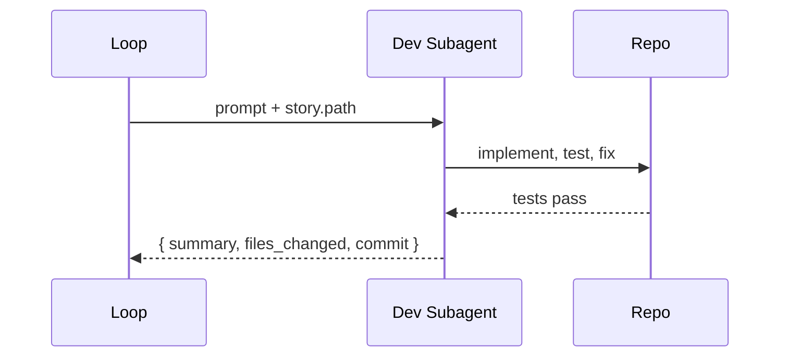

# The workflow

The dev loop runs in two macro steps: **ingest** (validate the input) and **execute** (drive each story through the pipeline).

## Step 1 — Ingest input

**File**: `skills/bmad-dev-loop/steps/step-01-ingest-input.md`

### What it does

1. Parses the invocation prompt for story keys (e.g. `4-1 4-2 4-3`).
2. Expands `epic-N` references by looking up `ready-for-dev` stories in `sprint-status.yaml`.
3. For each key, validates against sprint status (`ready-for-dev` only) and against file existence (`{implementation_artifacts}/{key}.md`).
4. Displays the plan.
5. Asks the user once for confirmation.
6. Writes the initial `loop-status.yaml`.

### Output

A validated list of stories, each with:

```yaml
- key: "4-1"
  path: "_bmad-output/implementation-artifacts/4-1-dry-run-mode.md"
  title: dry-run-mode
  status: ready-for-dev
```

If the list is empty after filtering, the skill HALTs with `blocked` and `no ready-for-dev stories in input list`.

### Resume point

The `current_index` field in `loop-status.yaml`'s frontmatter is the authoritative pointer. Re-running the skill reads it and picks up at the first story that is not `merged`.

## Step 2 — Execute loop

**File**: `skills/bmad-dev-loop/steps/step-02-execute-loop.md`

For each story, six phases.

### Phase 1 — DEV

Dispatches a synchronous subagent running `bmad-dev-story` against the story file. Stores the dev result (summary, files changed, commit hash, warnings) in `loop-status.yaml`.



If the dev subagent returns an error, the loop HALTs with `blocked` and `story dev failed: {key} — {details}`. **Stories are not skipped on dev failure** — the loop is paused, not resumed past them.

### Phase 2 — REVIEW

Dispatches a synchronous subagent running `bmad-code-review`. If `workflow.review_model_override` is set, the prompt includes a routing instruction.

If the review finds high-severity issues, a fix subagent is dispatched and the loop continues. Medium and low issues are recorded but do not block.

### Phase 3 — BRANCH / PR

The skill:

1. Determines the branch name: `{workflow.branch_prefix}{key}-{title}` (default `story/4-1-dry-run-mode`).
2. Force-recreates the branch locally if it already exists.
3. Commits the dev changes (and review-fix changes, if any) with a `feat(...)` or `fix(...)` message.
4. Pushes to origin.
5. Creates a PR via `gh pr create` with a body assembled from dev + review output.

### Phase 4 — CI

Polls `gh pr checks {pr_number}` every `workflow.ci_poll_interval_seconds` (default 30). On failure:

1. If `ci_attempts < ci_max_retries`: dispatch a CI-fix subagent, commit, push, re-poll.
2. If `ci_attempts >= ci_max_retries`: HALT with `CI failures persisted after {n} retries`.
3. If polling exceeds `workflow.ci_timeout_minutes`: HALT with `CI timeout for story {key}`.

### Phase 5 — MERGE

Runs `gh pr merge {pr_number} --{workflow.merge_strategy} --delete-branch`. Strategy is one of `squash`, `merge`, or `rebase`. Default `squash`.

If merge fails (conflicts, branch protection), the loop HALTs with `merge failed for story {key}`.

### Phase 6 — ADVANCE

`git checkout main && git pull origin main`. Increment `current_index`. Move to the next story.

## State transitions

Per-story status flows through:

```
pending
  → dev-in-progress
  → dev-done
  → review-in-progress
  → review-done
  → pr-in-progress
  → pr-created
  → ci-in-progress
  → ci-passed
  → merge-in-progress
  → merged
```

Any of these can be replaced with a terminal `blocked` status if a phase fails. The full taxonomy is in [Safety & HALT](/guide/safety).

## Subagent preconditions

Each subagent prompt instructs the agent to verify before starting:

```bash
git rev-parse --abbrev-ref HEAD   # current branch (sanity)
gh auth status                    # CLI authenticated
git status --porcelain            # working tree clean
```

These are advisory — the skill does not enforce them itself. The agent is responsible for surfacing issues if they fail.

## Concurrency model

- **No parallelism between stories.** Stories are processed in strict input order. PRs are reviewed and merged one at a time.
- **No parallelism within a story.** Dev then review then branch then PR then CI then merge — serial by design.
- **One subagent at a time.** Backgrounded subagents stall the loop. Always synchronous.
