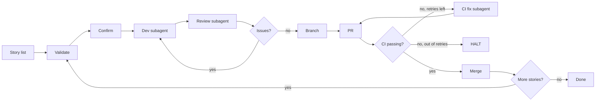

## The pipeline, at a glance

## Provenance

Originally delivered as **`bmad-loop`** in [leanproxy-mcp#245](https://github.com/mmornati/leanproxy-mcp/pull/245).
This is the standalone, hardened, distributable version — same state machine, same edge case handling, with a 3-layer TOML config, an `npx`-friendly installer, dry-run mode, and full resume semantics.

## License

MIT. © 2026 [Massimo Mornati](https://github.com/mmornati).
